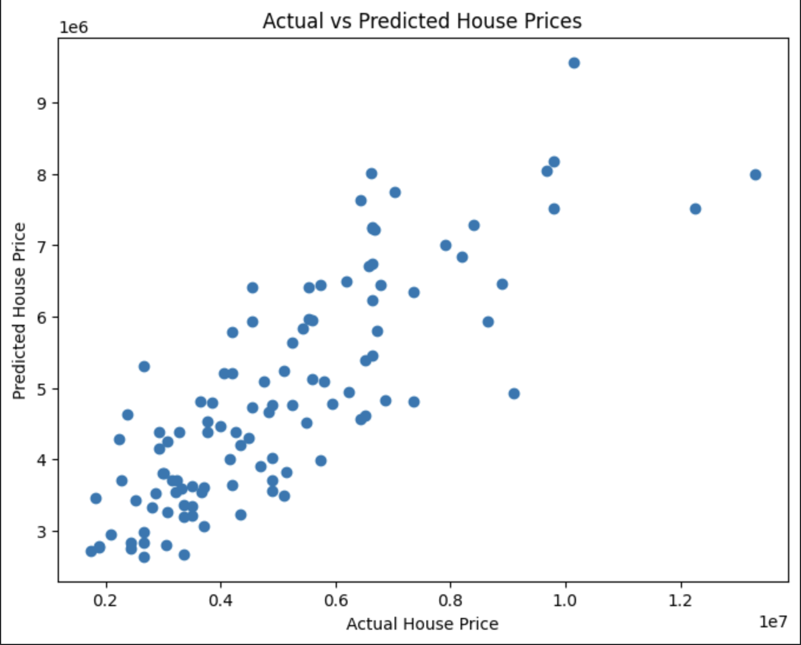

# House Price Prediction

## Project Overview

This project focuses on predictive analytics using historical housing data to forecast house prices. A Linear Regression model was developed to analyze the relationship between various property features and house prices, enabling accurate price predictions and trend analysis.

## Dataset

The dataset contains information about residential properties, including:

- Price
- Area
- Bedrooms
- Bathrooms
- Stories
- Parking
- Main Road Access
- Guest Room
- Basement
- Hot Water Heating
- Air Conditioning
- Preferred Area
- Furnishing Status

## Objectives

- Clean and preprocess housing data.
- Encode categorical variables.
- Build a predictive model using Linear Regression.
- Forecast house prices based on property characteristics.
- Evaluate model performance using regression metrics.
- Visualize actual and predicted house prices.

## Tools and Technologies

- Python
- Google Colab
- Pandas
- NumPy
- Scikit-learn
- Matplotlib

## Methodology

### 1. Data Loading and Exploration

The housing dataset was loaded and explored to understand the structure, features, and overall data quality.

### 2. Data Preprocessing

Categorical variables were encoded into numerical values to make the dataset suitable for machine learning algorithms.

### 3. Feature Selection

The following property features were used for prediction:

- Area
- Bedrooms
- Bathrooms
- Stories
- Parking
- Main Road Access
- Guest Room
- Basement
- Hot Water Heating
- Air Conditioning
- Preferred Area
- Furnishing Status

### 4. Train-Test Split

The dataset was divided into training and testing sets using an 80-20 split ratio.

### 5. Model Training

A Linear Regression model was trained using the selected property features to learn relationships between house characteristics and market prices.

### 6. Prediction and Evaluation

The trained model was used to predict house prices on unseen data.

Evaluation metrics used:

- R² Score
- Mean Squared Error (MSE)

### 7. Visualization

Actual house prices were compared with predicted house prices using a scatter plot to assess model performance visually.

## Prediction Visualization

## Results

The Linear Regression model successfully predicted house prices using historical housing data and property characteristics.

## Business Insights

- Property area has a strong influence on house prices.
- Houses with additional amenities generally have higher market value.
- Location-related features contribute significantly to pricing.
- Predictive analytics can support real estate pricing decisions and investment planning.

## Project Outcome

This project demonstrates the practical application of predictive analytics and machine learning for forecasting house prices using historical real estate data.

## Author

**Shourya Rajpoot**
